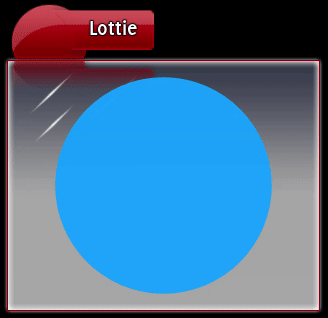

Lottie is a popular format for rendering vector-based animations.

APUI comes integrated with the Lottie plugin for drawing Lottie animations. The plugin uses the [rlottie](https://github.com/Samsung/rlottie) library to render the animations.

When APUI is built with the Lottie plugin, the `<lottie>` element is available as a normal HTML tag.


### \<lottie\>

The `<lottie>` element is used to include animations in the document.

_Attributes_

`src` = uri (CT)
: The source location of the JSON-file describing the Lottie animation.




### Building with the Lottie plugin

The Lottie plugin is integrated and built with the Core APUI library once it is enabled. Then, the plugin is automatically loaded during the call to `apui::Initialise()`.

First, we demonstrate how to download and build the required [rlottie](https://github.com/Samsung/rlottie) dependency. Open up a terminal and navigate to `APUI/Dependecies`. Then execute the following commands.

```cmd
git clone --branch v0.2 https://github.com/Samsung/rlottie.git
cd rlottie
mkdir build
cd build
cmake -DBUILD_SHARED_LIBS=OFF ..
cmake --build . --target rlottie --config Debug
cmake --build . --target rlottie --config Release
```

You may want to adjust the CMake arguments to your preferences.

Then, during [CMake configuration](building_with_cmake.html) of APUI, set the option `ENABLE_LOTTIE_PLUGIN=ON`. This will ensure that the Lottie plugin is integrated and built together with `RmlCore`. For example, in the `APUI/Build` directory execute the following:

```cmd
cmake -DBUILD_SHARED_LIBS=OFF -DENABLE_LOTTIE_PLUGIN=ON -DBUILD_SAMPLES=ON ..
```

This should automatically locate the `rlottie` library. You can now build and run the included `lottie` sample as you would any other sample to try out the plugin.


### Including the Lottie plugin

To include the Lottie plugin in your own project, make sure you build APUI with the CMake option `ENABLE_LOTTIE_PLUGIN` enabled as described above, and [integrate APUI into your project](integrating.html) as normal. In addition, you will need to link with the `rlottie` library.

The plugin is then automatically loaded during the call to `apui::Initialise()`. If everything has worked out properly, the log will output a short message about the Lottie plugin being initialised. The `<lottie>` element should then be available for displaying animations.
