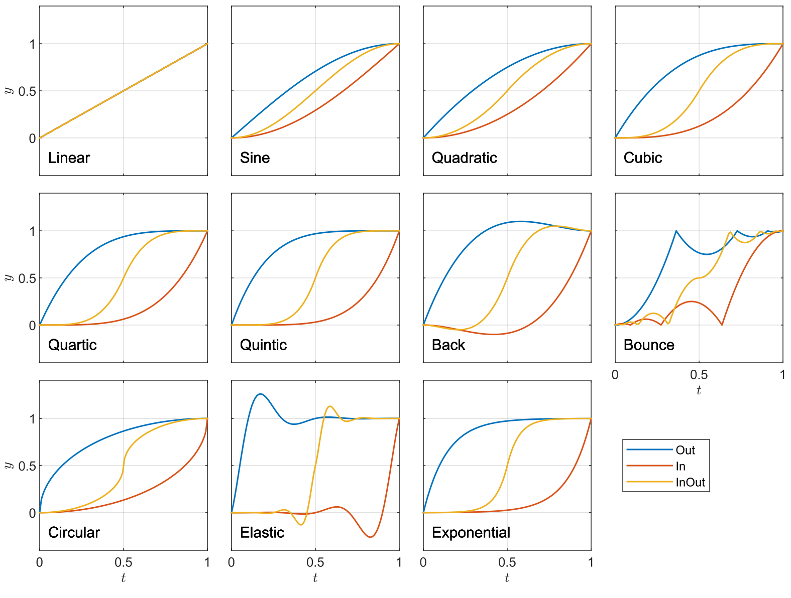

APUI provides comprehensive support for animations, transitions, and transforms. Together, they can be used to build very rich user experiences. These features are generally modeled after the CSS3 specifications, with some differences.

See also the [C++ documentation](../cpp_manual/animations_transforms.html) on animations and transforms.

### Animations


Most CSS properties can be animated, this includes properties representing numbers, lengths, percentages, angles, colors, transforms, and keywords. Animations can be specified entirely in CSS, with keyframes.

`animation`

Value: | none \| \[\<duration\> \<delay\>? \<tweening-function\>? \[\<num-iterations\>\|infinite\]? alternate? paused? \<keyframes-name\>\]<span class="prop-def-symbol" title="one or more comma-separated occurrences">#</span>
Initial: | none
Applies to: | all elements
Inherited: | no
Percentages: | N/A

`none`
: No animations specified.

`<duration>`
: Duration of the animation, specified in seconds (`s` unit). Required value.

`<delay>`
: Time delay before starting the animation, specified in seconds. Default: `0s`.

`<tweening-function>`
:  Tweening functions specify how the animated value progresses during the animation cycle. See [tweening functions](#tweening-functions) below for details and possible values. Default: `linear-in-out`.

`<num-iterations> | infinite`
: Number of iterations to play the animation before pausing. Specify as an integer or the keyword `infinite`. Default: 1.

`alternate`
: If present, alternate the direction of the animation every other cycle.

`paused`
: If present, the animation does not start on load.

`<keyframes-name>`
: A string specifying the name of the keyframes. Keyframes are specified [as in CSS](https://developer.mozilla.org/en-US/docs/Web/CSS/@keyframes), see examples below. Required value.

Values can be given in any order, with the exception that `duration` must come before `delay`.

Example usage:

```css
@keyframes my-progress-bar {
	0%, 30% {
		background-color: #d99;
	}
	50% {
		background-color: #9d9;
	}
	to { 
		background-color: #f9f;
		width: 100%;
	}
}
#my_element {
	width: 25px;
	animation: 2s cubic-in-out infinite alternate my-progress-bar;
}
```

Multiple animations can be specified on the same element by using a comma-separated list. 

```css
@keyframes my-progress-bar { ... }
@keyframes make-red {
	from { color: #333; }
	to   { color: #f33; }
}
#multi-animation { animation: 1s elastic-out my-progress-bar, 2s make-red; }
```

Internally, animations apply their properties on the local style of the element. Thus, mixing HTML style attributes and animations should be avoided on the same element.

See the `animation` sample for more examples and details.


### Transitions


Transitions apply an animation between two property values on an element when its property changes. Transitions are implemented in CSS similar to how they operate in CSS. However, in CSS, they only apply when a class or pseudo-class is added to or removed from an element.

`transition`

Value: | none \| \[\[\<property-name\><span class="prop-def-symbol" title="one or more space-separated occurrences">+</span> \| all \| none\] \<duration\> \<delay\>? \<tweening-function\>?\]<span class="prop-def-symbol" title="one or more comma-separated occurrences">#</span>
Initial: | none
Applies to: | all elements
Inherited: | no
Percentages: | N/A

`none`
: No transitions specified.

`<property-name>+ | all | none`
: Specifies the list of properties to be animated when they are changed, as a space-separated list of names. Alternatively, the `all` keyword animates all properties, while `none` will not animate any properties.

`<duration>`
: Duration of the animation, specified in seconds (`s` unit). Required value.

`<delay>`
: Time delay before starting the animation, specified in seconds. Default: `0s`.

`<tweening-function>`
:  Tweening functions specify how the animated value progresses during the animation cycle. See [tweening functions](#tweening-functions) below for details and possible values. Default: `linear-in-out`.

Values can be given in any order, with the exception that `duration` must come before `delay`. Multiple transitions can be specified on the same element by using a comma-separated list.

Example usage:

```css
#transition_test {
	transition: padding-left background-color transform 1.6s elastic-out;
	transform: scale(1.0);
	background-color: #c66;
}
#transition_test:hover {
	padding-left: 60px;
	transform: scale(1.5);
	background-color: #ddb700;
} 
```

See the `animation` sample for more examples and details. 


### Tweening functions


Animations and transitions can optionally take a *tweening* function, which specifies how the animated value progresses during the animation cycle. Here, we deviate from the CSS specs where they are instead called `animation-timing-function`s.

A tweening function in CSS is specified as `<name>-in`, `<name>-out`, or `<name>-in-out`, with one of the following names,

- `back`
- `bounce`
- `circular`
- `cubic`
- `elastic`
- `exponential`
- `linear`
- `quadratic`
- `quartic`
- `quintic`
- `sine`

See the animation and transition documentation above for usage examples there. Each tweening function provides a specific mapping between normalized time *t* and used interpolation value *y*, as seen in the following plot.
<div>
	
</div> 


See also the `demo` sample, where users can play with different tweening functions and durations, and see the resulting animation. It is also possible to provide a custom tweening function in the [C++ animation API](../cpp_manual/animations_transforms.html).


### Transforms


Transforms can be applied to elements using the `transform` property. The related properties `transform-origin`, `perspective`, and `perspective-origin` are also supported in CSS, which controls aspects of how the transform will be applied and rendered. These are roughly equivalent to their respective [CSS properties](https://developer.mozilla.org/en-US/docs/Web/CSS/transform).

```css
transform: rotateX(10deg) skew(-10deg, 15deg) translateZ(100px);
transform-origin: left top 0;
perspective: 1000px;
perspective-origin: 20px 50%;
```

`transform`

Value: | none \| \<transform-function\><span class="prop-def-symbol" title="one or more space-separated occurrences">+</span>
Initial: | none
Applies to: | all elements
Inherited: | no
Percentages: | See individual transform functions

`none`
: No transform applied.

`<transform-function>+`
: Specifies a list of transform functions to be applied to the element, see [all available values](#transform-functions) below.


`transform-origin`


Value: | \[\<transform-origin-x\> <span class="prop-def-symbol" title="one or both must be specified">\|\|</span> \<transform-origin-y\>\] \<transform-origin-z\>?
Initial: | 50% 50% 0px
Applies to: | all elements
Inherited: | no
Percentages: | Relative to the size of the element's border-box.

Describes the origin point around which the transformation occurs, given as the distance from the top-left corner of the element's border-box. This is a shorthand property, the underlying properties are specified along each dimension as follows.

`transform-origin-x`: \[left \| center \| right \| \<length-percentage\>\]

`transform-origin-y`: \[top \| center \| bottom \| \<length-percentage\>\]

`transform-origin-z`: \<length\>


#### Transform functions


All transform functions and their argument types are listed in the following. 

**`<transform-function>`**

`matrix`( `<number>#{6}` )            |  `rotateZ`( `<angle>` )       |  `skewX`( `<angle>` )
`matrix3d`( `<number>#{16}` )         |  `scale`( `<number>#{1,2}` )  |  `skewY`( `<angle>` )
`perspective`( `<length>` )           |  `scale3d`( `<number>#{3}` )  |  `translate`( `<length-percentage>#{2}` )
`rotate`( `<angle>` )                 |  `scaleX`( `<number>` )       |  `translate3d`( `<length-percentage>#{2}, <length>` )
`rotate3d`( `<number>#{3}, <angle>`)  |  `scaleY`( `<number>` )       |  `translateX`( `<length-percentage>` )
`rotateX`( `<angle>` )                |  `scaleZ`( `<number>` )       |  `translateY`( `<length-percentage>` )
`rotateY`( `<angle>` )                |  `skew`( `<angle>#{2}` )      |  `translateZ`( `<length>` )

See a detailed description for each function in the [CSS Transforms specification](https://drafts.csswg.org/css-transforms-2/#transform-functions). Angles take units of 'deg' or 'rad'. See also the `transform` and `animation` samples for more examples.


#### Perspective


`perspective`

Value: | none \| \<length ≥ 0px\>
Initial: | none
Applies to: | all elements
Inherited: | no
Percentages: | N/A

Perspective can make objects that are farther away appear smaller, when combined with 3d transformations.

`none`
: No perspective applied, equivalent to an infinite distance.

`<length ≥ 0px>`
: Distance to the center of projection.


`perspective-origin`


Value: | \<perspective-origin-x\> <span class="prop-def-symbol" title="one or both must be specified">\|\|</span> \<perspective-origin-y\>
Initial: | 50% 50%
Applies to: | all elements
Inherited: | no
Percentages: | Relative to the size of the element's border-box.

Describes the origin point for the `perspective` property. This is a shorthand property, the underlying properties are specified along each dimension as follows.

`perspective-origin-x`: \[left \| center \| right \| \<length-percentage\>\]

`perspective-origin-y`: \[top \| center \| bottom \| \<length-percentage\>\]


#### Interpolation

APUI has full interpolation support for transforms, making them very attractive to use in combination with animations and transitions.

<video src="../animations/animation_sample.webm" width="640" height="360" poster="../animations/animation_sample_poster.png" preload="metadata" controls></video>

The following video demonstrates transitions with transforms on a main menu.

<video src="../animations/game_main_menu.webm" width="640" height="360" poster="../animations/game_main_menu_poster.png" preload="metadata" controls></video>

With transforms applied to the elements, we can essentially move the camera as if in three-dimensional space by changing the perspective and origin, as shown in the following.

<video src="../animations/game_menu_transform.webm" width="640" height="360" poster="../animations/game_menu_transform_poster.png" preload="metadata" controls></video>
