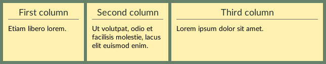

Flexible box (flexbox) layout is made for placing items along a single direction. It allows flexible sizing of items, both shrinking to avoid overflow as well as growing to fill the container. Both horizontal and vertical alignment can be controlled. Together, these properties make this layout scheme powerful for many types of user interfaces.

APUI generally follows the [CSS Flexible Box specification](https://www.w3.org/TR/css-flexbox-1/), although there are some smaller differences. There are many resources on how to write flexbox layout in CSS on the web, see eg. a [flexbox introduction at MDN](https://developer.mozilla.org/en-US/docs/Web/CSS/CSS_Flexible_Box_Layout) and an illustrated overview of the [flexbox properties at CSS-Tricks](https://css-tricks.com/snippets/css/a-guide-to-flexbox/).

Flexbox layout is initialized by setting an element's [`display` property](visual_formatting_model.html#display) to `display: flex` or `display: inline-flex`. This generates a flex container for the element, and all its children are formatted as flex items within this container. In CSS, `inline-flex` boxes are required to have their widths set to a definite (non-auto) value.


### Basic example

```css
.flex {
	display: flex;
	background: #66806a;
	padding: 3px;
}
.flex > div {
	background-color: #fff1af;
	padding: 10px;
	margin: 3px;
	flex: 1;
}
.flex > .double-width {
	flex: 2;
}
h2 {
	text-align: center;
	font-size: 1.3em;
	color: #243434;
	border-bottom: 1px #666;
}
```

```html
<div class="flex">
	<div>
		<h2>First column</h2>
		<p>Etiam libero lorem.</p>
	</div>
	<div>
		<h2>Second column</h2>
		<p>Ut volutpat, odio et facilisis molestie, lacus elit euismod enim.</p>
	</div>
	<div class="double-width">
		<h2>Third column</h2>
		<p>Lorem ipsum dolor sit amet.</p>
	</div>
</div>
```
##### Output

The rendered output is shown below. Notice that all columns are the same height. This is easy to accomplish in flexible layout, but difficult in any other layout mode when the height depends on the content. Furthermore, the width of the last column will always be exactly twice the width of each of the first two columns.




### Differences from CSS

##### Behavior

- Anonymous flex items will not be constructed from non-wrapped text.
- No automatic minimum-sizing of flex items. Generally, APUI does not have the 'min-content' size concept.
- Baseline alignment is only approximate.
- Aspect ratio of elements are never used to determine their size.
- Stretched items are not [reformatted](https://www.w3.org/TR/css-flexbox-1/#algo-stretch).

##### Properties and values

- Property `order` is not supported.
- Property `gap` is not currently supported for flexbox.
- Property value `flex-basis: content` is not supported.
- Property value `visibility: collapse` is not supported.


### Performance

To achieve the best performance, avoid content based sizing to prevent formatting the same flex items multiple times:

- Use the `flex: <number ≥ 1> ` shorthand.
- Set a definite height (length or percentage) on the flex items – or width in column layout.
  
This is increasingly important when the flex items are complicated to format, such as when using flexbox for larger layout structures.


### Orientation

`flex-direction`


Value: | row \| row-reverse \| column \| column-reverse
Initial: | row
Applies to: | flex containers
Inherited: | no
Percentages: | N/A

Determines the direction the flex items are laid out in – the *main axis*. Using `row` or `row-reverse`, the main axis is horizontal, while for `column` or `column-reverse` the main axis is vertical. The `-reverse` suffixes makes items be arranged in reverse order along the main axis.


`flex-wrap`


Value: | nowrap \| wrap \| wrap-reverse
Initial: | nowrap
Applies to: | flex containers
Inherited: | no
Percentages: | N/A

When there is no more space to place items along the main axis, the `wrap` and `wrap-reverse` values makes it so the items are wrapped to a new flex line along the *cross axis*. The cross axis is defined as perpendicular to the main axis. The `wrap-reverse` value makes lines be arranged in reverse order.


`flex-flow`


A shorthand for setting the `flex-direction` and `flex-wrap` properties in that order.


### Flexibility

#### The 'flex' shorthand


`flex`

Value: | auto \| none \| \<flex-grow\> \<flex-shrink\>? \<flex-basis\>? \| \<flex-basis\>
Initial: | 0 1 auto
Applies to: | flex items
Inherited: | no
Percentages: | N/A

A shorthand property for setting the flexible sizing behavior of flex items. Generally, the following short forms should cover most use cases:

`flex: *default*`
: Equivalent to `flex: 0 1 auto`. Items will be sized according to their content size, but allow shrinking proportionally if the container is too small in order to avoid overflow.

`flex: auto`
: Equivalent to `flex: 1 1 auto`. Items will initially be sized according to their content size and then proportionally shrink or grow to fill the container. 

`flex: none`
: Equivalent to `flex: 0 0 auto`. Items will be sized according to their content size, and neither shrink nor grow.

`flex: <number ≥ 1> `
: Equivalent to `flex: <number> 1 0`. Items will be sized proportionally to their given `<number>` and fill the container. This enables the best performance.

When omitted from the `flex` shorthand, `flex-grow` and `flex-shrink` default to 1, while `flex-basis` defaults to 0. Note that this is different from their initial values.

The flexbox sizing algorithm will also respect min- and max-sizing constraints given on the items.


#### Individual flexible properties

The flexible size properties can also be controlled individually.

`flex-grow`


Value: | \<number\>
Initial: | 0
Applies to: | flex items
Inherited: | no
Percentages: | N/A

Sets the grow factor, allowing items to be grown from their initial size to match the container size, thereby filling the container. The flex items will grow proportionally to their given factor.

`flex-shrink`


Value: | \<number\>
Initial: | 1
Applies to: | flex items
Inherited: | no
Percentages: | N/A

Sets the shrink factor, allowing items to be shrinked from their initial size to match the container size, thereby avoiding overflow. The flex items will shrink proportionally to their given factor.

`flex-basis`


Value: | \<length\> \| \<percentage\> \| auto
Initial: | auto
Applies to: | flex items
Inherited: | no
Percentages: | relative to the flex container’s inner main size

Sets the flex item's basis size. That is, this gives the initial size before the item is grown or shrinked using the above factors. When specified as `auto`, the item's shrink-to-fit width will be used – or automatic block height in column layout. Otherwise, units are resolved the same way as for the [`width` property](visual_formatting_model_details.html#width).


### Alignment

Alignment occurs after sizing all the flex items, and determines how any available space is distributed between items, within flex lines, and between flex lines.

#### Margin 'auto' alignment

In cases where free space is available along either the main- or cross axis, flex items can be aligned by filling this space using `margin: auto` along the desired direction(s). When there are multiple auto-margins along a single axis they will each be given an equal proportion of the available space.

Note that any free space filled by auto-margins will thereby leave no more space for alignment with `justify-content` or `align-self` along that axis.

#### Main-axis alignment

`justify-content`


Value: | flex-start \| flex-end \| center \| space-between \| space-around \| space-evenly
Initial: | flex-start
Applies to: | flex containers
Inherited: | no
Percentages: | N/A

Determines the alignment of items along the main axis, that is, horizontal alignment in row layout.

#### Cross-axis alignment

`align-items`


Value: | flex-start \| flex-end \| center \| baseline \| space-around \| stretch
Initial: | stretch
Applies to: | flex containers
Inherited: | no
Percentages: | N/A

Determines the alignment of items along the cross axis, that is, vertical alignment in row layout.

`align-self`


Value: | auto \| flex-start \| flex-end \| center \| baseline \| space-around \| stretch
Initial: | auto
Applies to: | flex items
Inherited: | no
Percentages: | N/A

Override the cross-axis alignment specified on the parent container for this item only.

#### Packing flex lines

`align-content`


Value: | flex-start \| flex-end \| center \| space-between \| space-around \| space-evenly \| stretch
Initial: | stretch
Applies to: | multi-line flex containers
Inherited: | no
Percentages: | N/A

Determines how any available space in the flex container is distributed between multiple flex lines.
