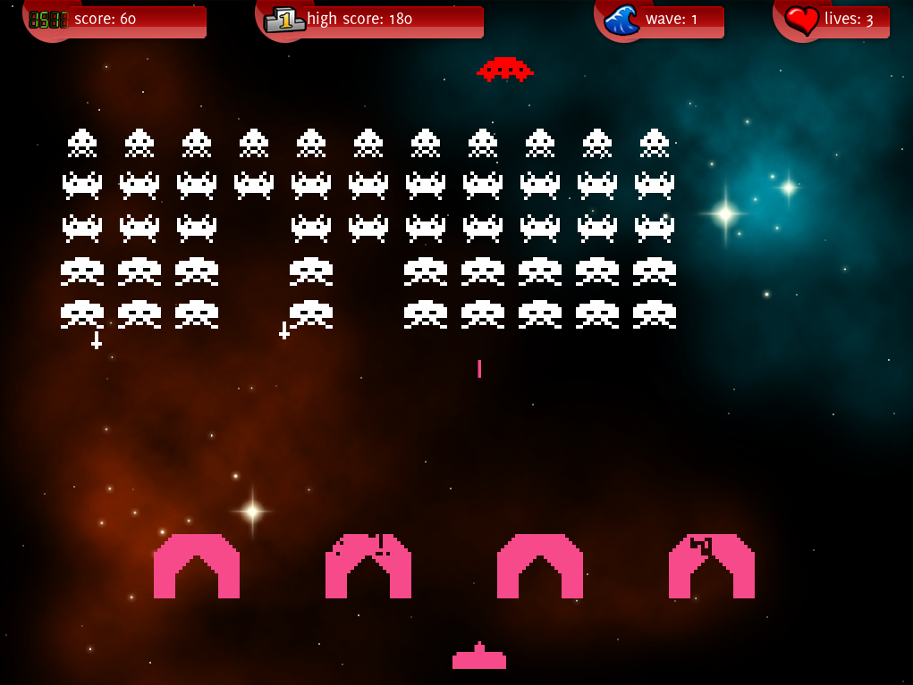\
Game interface from the 'invader' sample

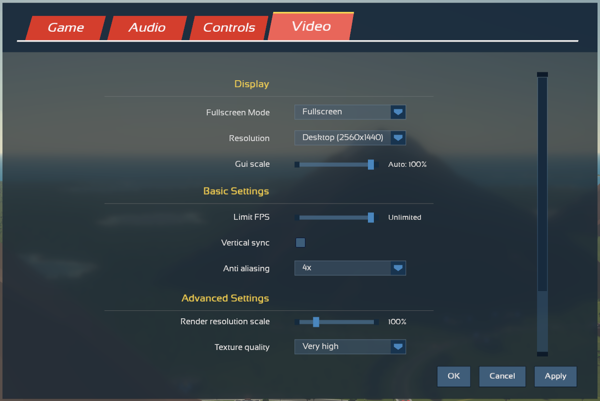\
Game menu

\
Installer software by [@xland](https://github.com/xland)

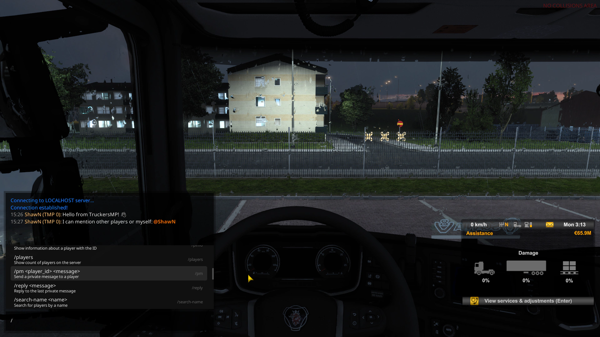\
[TruckersMP](https://truckersmp.com/) A multiplayer mod for truck simulators - Chat box in APUI

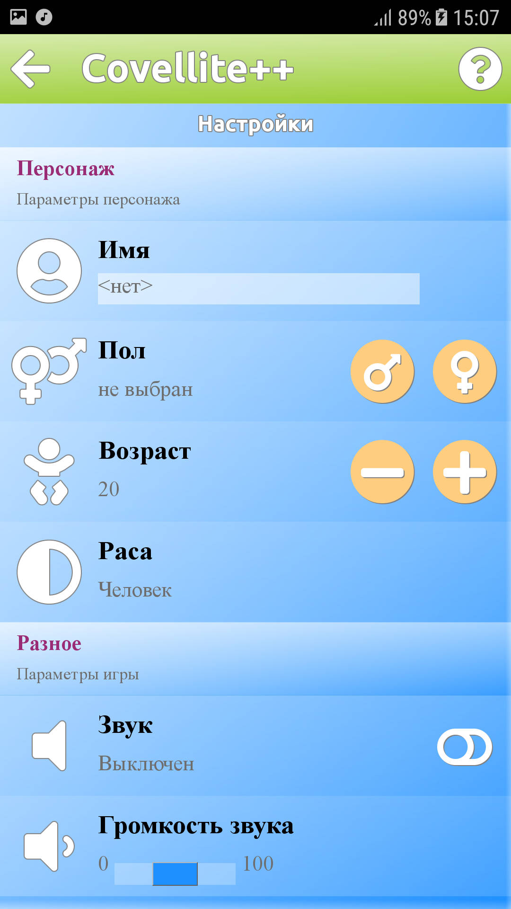
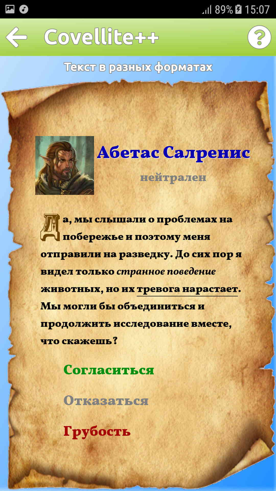\
[Covellite++](http://unicornum.github.io/Covellitepp/index.html) A cross-platform framework

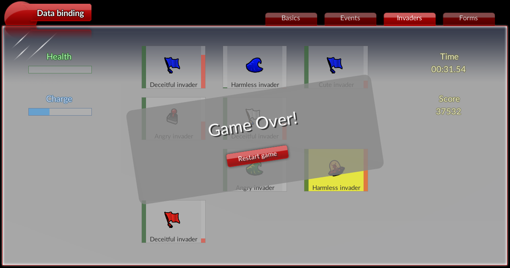\
Cute little game from the 'databinding' sample

<video src="animations/animation_sample.webm" width="640" height="360" poster="animations/animation_sample_poster.png" preload="metadata" controls></video> 
Animations and transitions from the 'animation' sample

<video src="animations/game_main_menu.webm" width="640" height="360" poster="animations/game_main_menu_poster.png" preload="metadata" controls></video> 
Transitions with transforms on a game menu

<video src="animations/game_menu_transform.webm" width="640" height="360" poster="animations/game_menu_transform_poster.png" preload="metadata" controls></video> 
Camera movement in a game menu

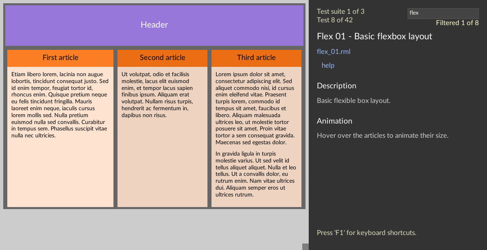\
APUI visual testing framework

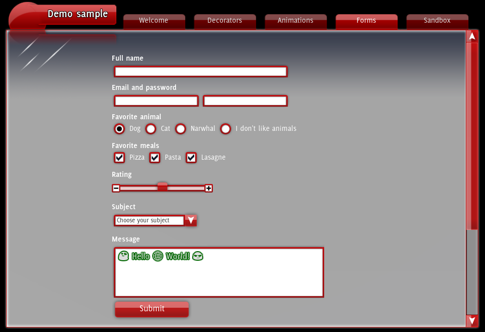\
Form controls from the 'demo' sample

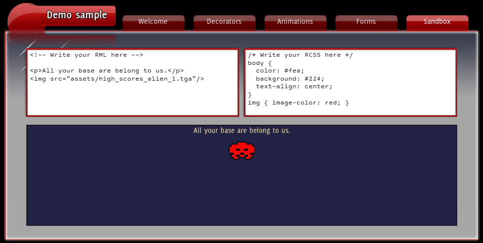\
Sandbox from the 'demo' sample, try it yourself!

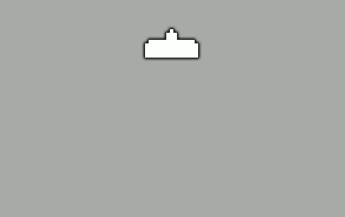\
Transitions on mouse hover (entirely in CSS)

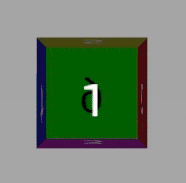\
Animated transforms (entirely in CSS)

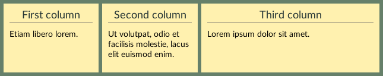\
Flexbox layout

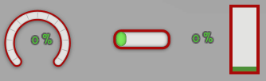\
Progress bars

\
Vector animations with the [Lottie plugin](C++/lottie.html)

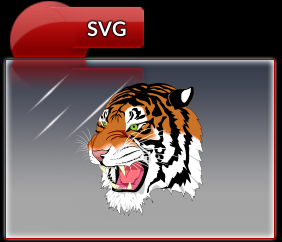\
SVG vector images with the [SVG plugin](C++/svg.html)
