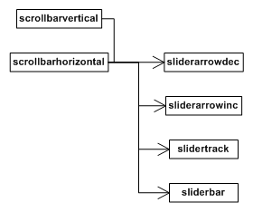
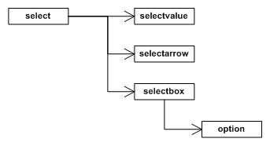

APUI features several functional elements that need to be sized and decorated with CSS properties, such as scrollbars, sliders and drop-down boxes. This document will go over all these elements and give recommendations on how you should style them.

### Scrollbars

Any element with scrolling overflow (a value of `scroll` or `auto` on either of the `overflow-x` or `overflow-y` properties) may generate scrollbars along its bottom or right side. By default, these are simple block elements with no background colour or decorator.

#### Generated elements

The scrollbar elements are tagged `scrollbarhorizontal` or `scrollbarvertical`, depending on their orientation. They are hidden elements parented directly to the scrolling element. Each scrollbar element contains four child elements:

* `sliderarrowdec`: The button at the top (or left) of the scrollbar which can be clicked to scroll further up (or to the left) the element.
* `sliderarrowinc`: The button at the bottom (or right) of the scrollbar which can be clicked to scroll further down (or to the right) the element.
* `slidertrack`: The track that runs between the two arrow buttons.
* `sliderbar`: The bar that runs on the track. It represents the size and position of the visible segment of the element's content. It can be dragged to scroll the visible window around. 



When both horizontal and vertical scrollbars are present on an element, they are both shortened by the amount necessary to avoid an intersection. Another element is created and placed in this intersection point, placed and sized appropriately. This corner element is tagged scrollbarcorner and exists only for decoration purposes.

#### Applying CSS properties

All of these elements can be styled through CSS to be sized, positioned and rendered appropriately. The recommended method for configuring a scrollbar is given below (note that this is for a vertical scrollbar; for a horizontal, swap width and height):

1. Set the `width` property of the `scrollbarvertical` element to the appropriate value for your interface design. This should be enough to encompass the arrows, track and bar.
2. Set the `width` and `height` properties of the `sliderarrowdec` and `sliderarrowinc` elements as appropriate. Set them to `0` if you don't want buttons.
3. Set the `width` property of the `slidertrack` as appropriate. The `height` value will be ignored for the track and will always be set internally. Use `margin-left` to position the track within the scrollbar.
4. Set the `width` property of the `sliderbar` as appropriate. The height of the bar will be generated internally, but you can override this with the `height` property, or use the `min-height` and `max-height` properties to influence it.
5. Apply decorators to the elements as appropriate. 

See the _Rocket Invaders from Mars_ demo style sheet and the [templating tutorial](tutorials/window_template.html) for more pointers.

#### The 'scrollbar-margin' property


`scrollbar-margin`

Value: | \<length\>
Initial: | 0px
Applies to: | scroll containers
Inherited: | no
Percentages: | N/A

As described above, the scrollbar elements (`scrollbarvertical` and `scrollbarhorizontal`) will shorten themselves automatically to avoid a corner intersection. This can lead to scenarios where a scrollbar is popping on and off (during a window resize, for example) and causing the other scrollbar to rapidly change size. To avoid this, and force a scrollbar to always shorten itself for a corner, you can use the numerical `scrollbar-margin` property on a scrollbar element. An element will shorten itself (on the bottom or right side, as appropriate) by the minimum of the appropriate corner dimension and the scrollbar margin.

#### Example CSS

The following is the section of the style sheet for _Rocket Invaders from Mars_ relevant for scrollbars.

```css
@spritesheet theme 
{
	src: invader.tga;
	
	/* ... */
	
	slidertrack-t: 70px 199px 27px 2px;
	slidertrack-c: 70px 201px 27px 1px;
	slidertrack-b: 70px 202px 27px 2px;
	
	sliderbar-t:         56px 152px 23px 23px;
	sliderbar-c:         56px 175px 23px 1px;
	sliderbar-b:         56px 176px 23px 22px;
	sliderbar-hover-t:   80px 152px 23px 23px;
	sliderbar-hover-c:   80px 175px 23px 1px;
	sliderbar-hover-b:   80px 176px 23px 22px;
	sliderbar-active-t: 104px 152px 23px 23px;
	sliderbar-active-c: 104px 175px 23px 1px;
	sliderbar-active-b: 104px 176px 23px 22px;
	 
	sliderarrowdec: 0px 152px 27px 24px;
	sliderarrowdec-hover: 0px 177px 27px 24px;
	sliderarrowdec-active: 0px 202px 27px 24px;
	
	sliderarrowinc: 28px 152px 27px 24px;
	sliderarrowinc-hover: 28px 177px 27px 24px;
	sliderarrowinc-active: 28px 202px 27px 24px;
}

/* Fix the width and push the scrollbar back to the extents of the window. */
scrollbarvertical
{
	margin-top: -6px;
	margin-bottom: -6px;
	margin-right: -11px;
	width: 27px;
}

/* Decorate the slider track. */
scrollbarvertical slidertrack
{
	decorator: tiled-vertical( slidertrack-t, slidertrack-c, slidertrack-b );
}
/* Darken the decorator on active. */
scrollbarvertical slidertrack:active
{
	image-color: #aaa;
}

/* Push the slider bar in 4 pixels from the left edge. Fix the width of the bar and make sure
   the height doesn't drop below 46 pixels; under that the decorator will start squishing the
   images. */
scrollbarvertical sliderbar
{
	margin-left: 4px;
	width: 23px;
	min-height: 46px;

	decorator: tiled-vertical( sliderbar-t, sliderbar-c, sliderbar-b );
}

/* Animate the bar's decorator on hover. */
scrollbarvertical sliderbar:hover
{
	decorator: tiled-vertical( sliderbar-hover-t, sliderbar-hover-c, sliderbar-hover-b );
}

/* Animate the bar's decorator on active. */
scrollbarvertical sliderbar:active
{
	decorator: tiled-vertical( sliderbar-active-t, sliderbar-active-c, sliderbar-active-b );
}

/* Fix the size of the 'page up' slider arrow and decorate it appropriately. */
scrollbarvertical sliderarrowdec
{
	width: 27px;
	height: 24px;
	
	decorator: image( sliderarrowdec );
}
/* Animate the arrows on hover. */
scrollbarvertical sliderarrowdec:hover
{
	decorator: image( sliderarrowdec-hover );
}
/* Animate the arrows on active. */
scrollbarvertical sliderarrowdec:active
{
	decorator: image( sliderarrowdec-active );
}


/* Fix the size of the 'page down' slider arrow and decorate it appropriately. */
scrollbarvertical sliderarrowinc
{
	width: 27px;
	height: 24px;
	
	decorator: image( sliderarrowinc )
}
/* Animate the arrows on hover. */
scrollbarvertical sliderarrowinc:hover
{
	decorator: image( sliderarrowinc-hover );
}
/* Animate the arrows on active. */
scrollbarvertical sliderarrowinc:active
{
	decorator: image( sliderarrowinc-active );
}
```

### Sliders

Range sliders can be instanced through the RML tag `<input type="range" ... />`. Internally these are very similar to scrollbars, and contain identical child elements, i.e.:

* `sliderarrowdec`
* `sliderarrowinc`
* `slidertrack`
* `sliderbar`

These are styled in the same way you style scrollbars. Note that for input types, the `type` attribute of an `<input>` element is automatically set as a class to ease their specification in a style sheet. So the following rule will apply properties to an input's slider track:

```css
input.range slidertrack
{
	/* ... */
}
```

### Drop-down selection boxes

Drop-down boxes can be instanced through the RML tag `<select>`, with individual options specified within the selection element with `<option>` tags.

#### Generated elements

The select element generates three hidden elements:

* `selectvalue`: The container element for the selected option.
* `selectarrow`: The button rendered to the right of the value element. 
* `selectbox`: The box containing the options. The visibility of this element is toggled when the arrow or value elements are clicked on, or when an option is selected.

The pseudo-class `:checked` is set on the select element while the selection box is visible. Additionally, the selected option inside its drop-down list also has the `:checked` pseudo-class set.



#### Example CSS

The following are the select element's CSS rules and properties from the _Rocket Invaders from Mars_ style sheet:

```css
@spritesheet theme 
{
	src: invader.tga;
	
	/* ... */
	
	selectbox-tl: 281px 275px 11px 9px;
	selectbox-t:  292px 275px 1px 9px;
	selectbox-tr: 294px 275px 11px 9px;
	selectbox-l:  281px 283px 11px 1px;
	selectbox-c:  292px 283px 1px 1px;
	selectbox-bl: 281px 285px 11px 11px;
	selectbox-b:  292px 285px 1px 11px;
	selectbox-br: 294px 285px 11px 11px;
	
	selectvalue: 162px 192px 145px 37px;
	selectvalue-hover: 162px 230px 145px 37px;
	selectarrow: 307px 192px 30px 37px;
	selectarrow-hover: 307px 230px 30px 37px;
	selectarrow-active: 307px 268px 30px 37px;
	
	/* ... */
}

/* Specify the dimensions of the select element. */
select
{
	width: 175px;
	height: 37px;
}

/* Specify the dimensions of the value element within the select element. Padding is used to position the
   value correctly internally. */
select selectvalue
{
	width: auto;
	margin-right: 30px;
	
	height: 28px;
	padding: 9px 10px 0px 10px;

	decorator: image( selectvalue  );
}

/* Animate the value field when it is hovered. */
select selectvalue:hover
{
	decorator: image( selectvalue-hover );
}

/* Fix the size of the select arrow decorate the element. */
select selectarrow
{
	width: 30px;
	height: 37px;
	
	decorator: image( selectarrow );
}

/* Animate the arrow when hovered. */
select selectarrow:hover
{
	decorator: image( selectarrow-hover );
}

/* Animate the arrow when the button is pressed or the box is visible. */
select selectarrow:active,
select selectarrow:checked,
{
	decorator: image( selectarrow-active );
}

/* Fix the width of the select box and fiddle with the margins to get it in exactly the right place. */
select selectbox
{
	margin-left: 1px;
	margin-top: -7px;
	width: 162px;
	padding: 1px 4px 4px 4px;

	decorator: tiled-box(
		selectbox-tl, selectbox-t, selectbox-tr, 
		selectbox-l, selectbox-c, auto,  /* auto mirrors left */
		selectbox-bl, selectbox-b, selectbox-br
	);
}

/* Sizes the option element to take up the available width in the select box. */
select selectbox option
{
	width: auto;
	padding-left: 3px;
}

/* Specifies every second option in the selection box to have a white background. */
select selectbox option:nth-child(even)
{
	background: #FFFFFFA0;
}

/* Gives the red highlight to the selection box. */
select selectbox option:hover
{
	background: #FF5D5D;
}
```
